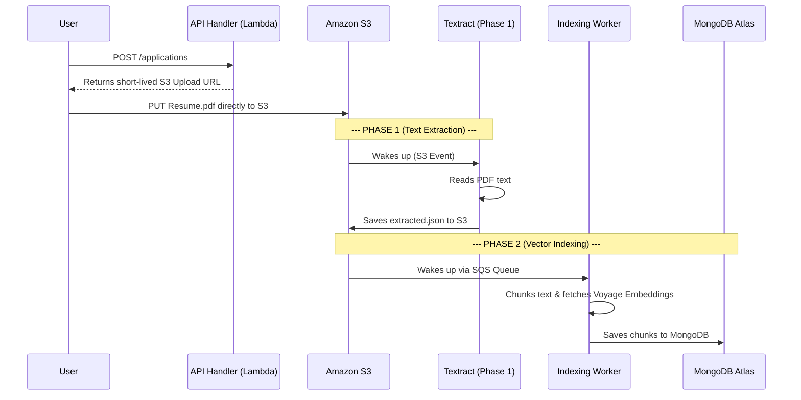

# Core Architecture & Data Flow

This document explains exactly how the AI Resume Screening SaaS works under the hood. It is written in simple terms to give you a crystal-clear understanding of where data travels and how to debug the system if something breaks.

---

## 1. What is the System Doing?

At a high level, this system allows multiple companies ("Tenants") to create Job Postings and collect Resumes (PDFs). Instead of a human reading hundreds of resumes, the system automatically:
1. Reads the text out of the PDF (OCR).
2. Breaks the resume into logical sections (Experience, Skills, Education).
3. Converts those sections into AI mathematical vectors (Embeddings).
4. Compares them against the Job Description to instantly rank the best candidates using Voyage AI.

Because this is a **SaaS (Software as a Service)**, it is designed so that Company A can never accidentally see Company B's resumes. 

---

## 2. The Role of AWS Resources

We use AWS to make the system **Serverless**. This means there are no servers running 24/7. You only pay for the exact milliseconds the code runs.

Here is what each AWS resource actually does:

*   **API Gateway (The Front Door):** Receives the `Invoke-RestMethod` (HTTP) commands you type. It routes these web requests to the correct Lambda function.
*   **Amazon S3 (The Filing Cabinet):** Stores all files. It holds the original `.pdf` resumes and the extracted `.json` text files. 
    *   *Crucial Feature:* S3 is configured to act as an alarm system. Whenever a file is dropped in a specific folder, S3 fires an event to wake up the rest of the system.
*   **Amazon Textract (The Reader):** AWS's built-in AI that opens PDFs and reads the text out of them.
*   **Amazon SQS (The Waiting Room):** Simple Queue Service. AI processing takes time. Instead of making the API wait 3 minutes and timing out, we drop a "ticket" into an SQS Queue. SQS holds the ticket safely until a Worker Lambda is ready to process it.
*   **AWS Lambda (The Brains):** Runs your Python code on demand. We have 4 distinct Lambdas:
    1.  `ApplicationApiHandler`: Answers the API Gateway. Creates DB records and generates secure S3 Upload URLs. Fast and lightweight.
    2.  `resume-start-textract` (Phase 1): Woken up by S3 when a PDF is uploaded. Sends the PDF to Textract.
    3.  `IndexingWorker` (Phase 2): Woken up by SQS when Textract finishes. Chunks the text, talks to Voyage AI, and saves vectors to MongoDB.
    4.  `ScreeningWorker` (Phase 3): Woken up by SQS when you click "Screen". Runs the heavy MongoDB Vector search and Voyage Reranker.

---

## 3. How the Data Travels (The Pipeline)

When a candidate applies, the data travels through three distinct phases:

### The S3 Path Hack (Important for Debugging!)
The old Phase 1 code strictly refused to read any file unless it was in a folder named `incoming/`. 
To avoid rewriting Phase 1, our API secretly renames the uploaded file to:
`incoming/saas__{tenant_id}__{job_id}__{application_id}.pdf`
When Phase 1 finishes, our `IndexingWorker` reads that filename, splits it apart at the `__`, and recovers the exact Company, Job, and Applicant IDs so it can safely save them to the database!

---

## 4. The MongoDB Schema (The State Machine)

MongoDB acts as both our standard database and our AI Vector database. 
To support Multi-Tenancy (SaaS), **almost every collection now requires a `tenant_id`**. If you search the database without a `tenant_id`, you are doing it wrong!

Here are the 5 collections and what they do:

### 1. `tenants`
*   **What it is:** The companies using your software.
*   **Fields:** `_id` (tenant_id), `name`, `status`.

### 2. `jobs`
*   **What it is:** The job postings created by a tenant.
*   **Fields:** `_id` (job_id), `tenant_id`, `title`, `description`, `application_count`.

### 3. `applications`
*   **What it is:** The link between a Job and a Candidate. It tracks the status of the resume as it moves through the AWS pipeline.
*   **Fields:** `_id` (application_id), `job_id`, `tenant_id`, `status`.
*   **Debugging Use:** If a resume isn't showing up, check `phase2_status` here. If it says "NOT_STARTED", it means the IndexingWorker never ran.

### 4. `candidate_chunks` (The Vector DB)
*   **What it is:** The actual resume text, broken into small paragraphs, alongside the 1024-dimension Voyage AI mathematical vector.
*   **How it works:** When you run a Hybrid Search, MongoDB mathematically compares the Job Description vector against the millions of vectors in this collection.
*   **Crucial Rule:** Every single chunk has a `tenant_id` and `job_id`. The search query *hardcodes* a filter for these IDs so Company A's search physically cannot see Company B's vectors.

### 5. `screening_runs`
*   **What it is:** The final leaderboard. When you trigger a screening, it creates a record here.
*   **How it works:** It stores the final array of candidates, ranked 1st, 2nd, 3rd, along with their Voyage AI `relevance_score`.

---

## 5. Quick Debugging Guide

If you ever run a screening and get `0 candidates`, follow this flow to find the broken link in the chain:

1.  **Check S3:** Did the PDF successfully upload to `incoming/saas__...pdf`?
2.  **Check S3 Extracted:** Did Phase 1 successfully create the `.json` file in the `extracted/` folder?
    *   *If NO:* Phase 1 Textract crashed. Check the `/aws/lambda/resume-start-textract` logs in AWS CloudWatch.
3.  **Check MongoDB `applications`:** Is the `phase2_status` set to `INDEXED`?
    *   *If NO:* The `IndexingWorker` Lambda crashed or the SQS queue didn't trigger. Check the `IndexingWorker` logs in CloudWatch.
4.  **Check MongoDB `candidate_chunks`:** Run a query for `{"job_id": "YOUR_JOB_ID"}`. Are there documents there?
    *   *If YES, but screening fails:* The issue is in the `ScreeningWorker`. Check its CloudWatch logs.
