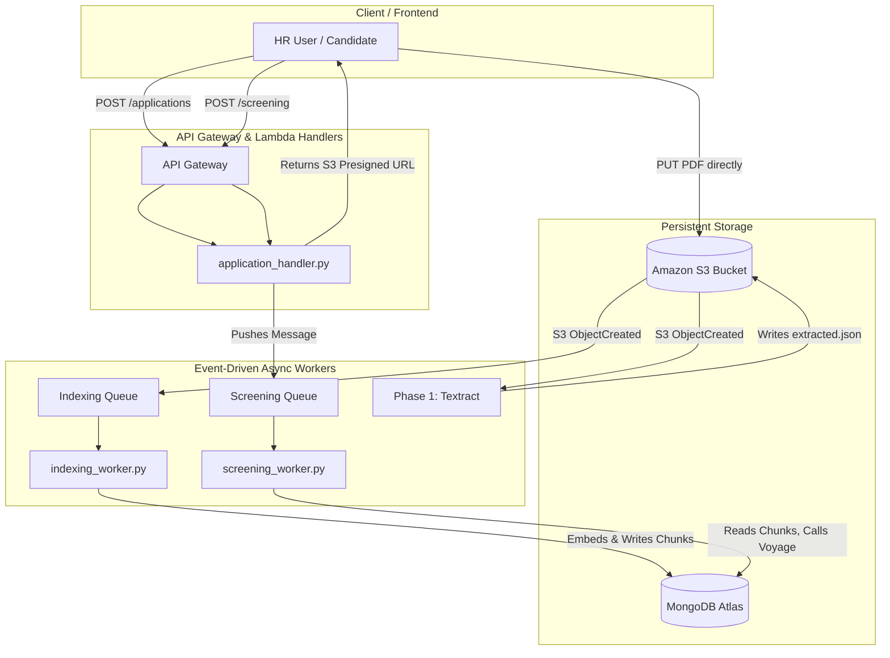

# SaaS Architecture (Multi-Tenant Serverless)

The AI-Powered Resume Screening system has evolved from a local CLI prototype into a multi-tenant, event-driven SaaS backend. This document describes the architecture defined in `template.yaml` and implemented in the `api/` directory.

## 1. Design Goals & Constraints
*   **Strict Tenant Isolation**: Data from Company A must never leak into Company B's searches or results.
*   **Zero-Idle Cost (Serverless)**: To operate within a $100 AWS free-tier limit, there are no always-on instances (no EC2, ECS, EKS, RDS, or OpenSearch). The compute layer scales to exactly zero when no users are active.
*   **Asynchronous Orchestration**: AI models (Textract, Voyage Embeddings, Voyage Rerank) can be slow. Processing must be decoupled from the REST API to prevent HTTP timeouts.

## 2. Infrastructure Overview

The infrastructure relies on AWS Serverless Application Model (SAM):



## 3. Storage Architecture

### 3.1 Amazon S3 Path Structure
S3 objects are strictly scoped by a deterministic path that establishes tenant identity:
```text
tenants/{tenant_id}/jobs/{job_id}/applications/{application_id}/original.pdf
tenants/{tenant_id}/jobs/{job_id}/applications/{application_id}/extracted.json
```
By locking PDFs to specific applications (rather than a global "incoming" folder), we resolve candidate-reuse issues. If John applies to two jobs across two tenants, his resume is physically copied, preserving the point-in-time snapshot for each job separately.

### 3.2 MongoDB Atlas Collections
MongoDB serves as the state tracker, metadata store, and Vector database.
*   `tenants`: Company profiles.
*   `jobs`: Job descriptions and metadata.
*   `applications`: State machine tracking for a candidate's journey (PENDING_UPLOAD → INDEXING → INDEXED).
*   `candidate_chunks`: Phase 2 vectorized resume chunks. Crucially, every chunk now carries `tenant_id` and `job_id`.
*   `screening_runs`: Asynchronous job executions containing final Phase 3 ranks.

## 4. REST API Endpoints (`application_handler.py`)

*   `POST /tenants`: Creates a company.
*   `POST /tenants/{id}/jobs`: Creates a job description.
*   `GET /tenants/{id}/jobs/{id}`: Views a job's status.
*   `POST /jobs/{id}/applications`: Registers a candidate and returns a short-lived **S3 Presigned URL**. This offloads PDF upload bandwidth completely from the API Gateway.
*   `POST /jobs/{id}/screening`: Enqueues an asynchronous screening run via SQS.
*   `GET /jobs/{id}/screening-results`: Fetches the final AI ranks.

## 5. Event-Driven Workers

### 5.1 Indexing Worker (`indexing_worker.py`)
Triggered when Phase 1 (Textract) finishes writing `extracted.json` to S3.
*   Parses the `tenant_id` and `job_id` from the S3 path.
*   Chunks the text.
*   Calls Voyage AI to generate embeddings.
*   Upserts the vectors into MongoDB.
*   Updates the `application` state to `INDEXED`.

### 5.2 Screening Worker (`screening_worker.py`)
Triggered when an HR user calls `POST /jobs/{id}/screening`.
*   Fetches the job description from MongoDB.
*   Runs **Phase 2 Hybrid Retrieval** (BM25 + Vector Search) against the `candidate_chunks` collection. The MongoDB aggregation pipelines are strictly pre-filtered by `{"tenant_id": tenant_id, "job_id": job_id}` to guarantee data isolation.
*   Runs **Phase 3 Semantic Reranking** via Voyage AI.
*   Writes the final array of ranked candidates back to the `screening_runs` MongoDB collection and saves a permanent JSON audit trail in S3.

## 6. Security and Isolation
1.  **IAM Least Privilege**: Lambdas only possess permissions required for their specific queues and S3 prefixes.
2.  **API Gateway JWT (Future)**: The endpoints are designed to accept Auth headers, which should extract the `tenant_id` from the JWT claims.
3.  **No PII Logging**: Log lines only emit UUIDs.
4.  **Database Isolation**: Atlas Search and Vector Search pipelines physically cannot return documents from another tenant due to hardcoded aggregation filters injected by the workers.
